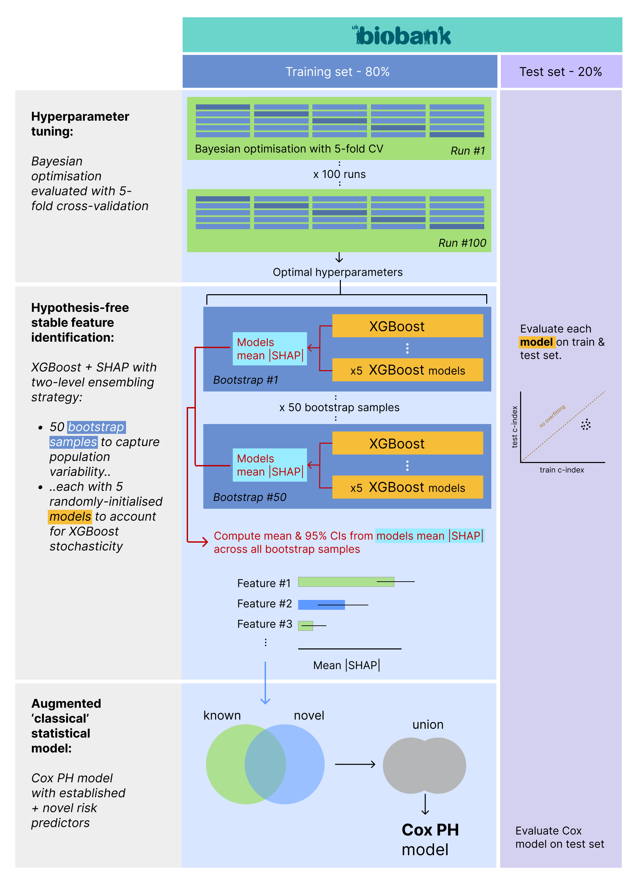

# OncoBoost
XGBoost + CoxPH for hypothesis-free identification of novel cancer risk predictors in UK Biobank.
_Developed for prediction of cancer but pipeline accepts any disease codes (ICD10/9)._

_[full code to be released on publication]_

## 🧬 Methods

### 📂 Feature sets
Automated extraction pipeline for all UK Biobank data at baseline: baseline assessment, prevalent conditions (from HES, GP, self-report, cancer registry), medications (mapped to ATC drug names), and proteomics.

### 🎯 Outcomes
Survival outcomes (time-to-event) defined using cancer registries until censoring and HES records thereafter.
For censoring date, take minimum(death, loss to follow up, maximum[regisry censoring or HES censoring])

### Pipeline
1. Hyperparameter tuning: bayesian optimisation with 5 fold CV
2. Feature identification: XGBoost + SHAP (SHapley Additive exPlanations) values with two-level ensembling strategy for stabilisation of SHAP values:
    - 50 bootstrap samples to capture population variability and derive 95% CIs
    - each with 5 randomy initialised models to account for XGBoost stochasticity
3. Cox model with established + novel risk predictors. 
- ⚡ Parallelised to run models across multiple GPUs 

## Example result
Progressive stabilisation of SHAP values over 50 bootstraps for colon cancer (core dataset)

